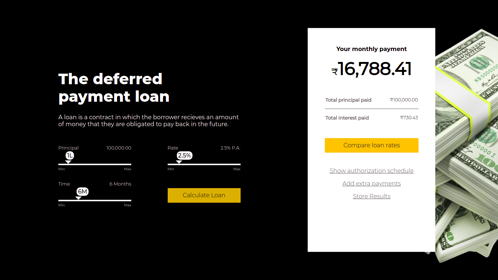

<h1 align="center">Deferred Loan Payment Calulator</h1>

[**Deferred Payment Loan**](https://deferred-loan-payment.netlify.app/) is an attempt to make a hassle free and simplistic approach towards calculation of loans and EMI's.

The design of the project is inspired by the design of [**Vladimir Gruev's**](https://dribbble.com/shots/6635872-Loan-Calculator) dribble post.

 

 
 

The project is build from scratch using **React.JS** and **CSS**. No external library is used in developing the project.

 

### Formula Used In Calculating the loan

> **EMI** = [P * R * (1 + R)^N]/[(1 + R)^N - 1]
>
> where P = Principal Amount,
> R = Rate per month (not in %),
> N = Time duration in months

 

### Setting Up Project In Your Machine

- Clone the project - &nbsp; `$ git clone https://github.com/bajaj99prashant/deferred-payment-loan.git`

- Change directory - &nbsp; `$ cd deferred-payment-loan`

- Install required node packages - &nbsp; `$ npm install`

- Start your localhost server - &nbsp; `$ npm start`

- Normally server starts at port **localhost:3000**, visit your browser at this port to have fun with project.

- Build Command - &nbsp; `$ npm run build` &nbsp; to build the project for production.

 

### References

- [React Docs](https://reactjs.org/docs/getting-started.html)
- [CSS Tricks](https://css-tricks.com/)
- [Mozilla Docs](https://developer.mozilla.org/en-US/docs/Web)
